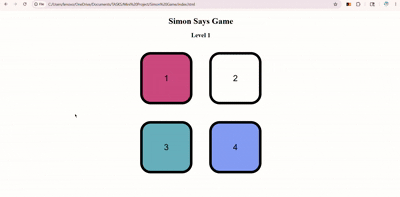

# Simon Says Game 🎮

A simple and interactive **Simon Says memory game** built using **HTML, CSS, and JavaScript**.

The game tests the player's memory by generating a sequence of colors that the player must repeat correctly.
With every correct level, the sequence becomes longer and more challenging.

---

<h2 align="center">🎮 Game Demo</h2>

<p align="center">
  
</p>


## 🚀 Features

* Interactive color button animations
* Random sequence generation
* User input tracking
* Level progression
* Game over detection
* Restart functionality

---

## 🛠️ Technologies Used

* **HTML5**
* **CSS3**
* **JavaScript (DOM Manipulation)**

---

## 📂 Project Structure

```bash
Simon-Game/
│── index.html
│── style.css
│── app.js
│── README.md
```

---

## 🎯 How to Play

1. Press any key to start the game.
2. Watch the highlighted color sequence carefully.
3. Repeat the sequence by clicking the buttons in the correct order.
4. Every successful round increases the level and adds a new color.
5. If you click the wrong button, the game ends.
6. Press any key to restart.

---

## 💻 Installation & Setup

### Clone the repository

```bash
git clone https://github.com/your-username/Simon-Game.git
```

### Open the project folder

```bash
cd Simon-Game
```

### Run the project

Open **index.html** in your browser
or use **Live Server** in VS Code.

---

## 🔮 Future Improvements

* Add sound effects
* Add score tracking
* Add difficulty levels
* Improve UI/UX design
* Mobile responsiveness


